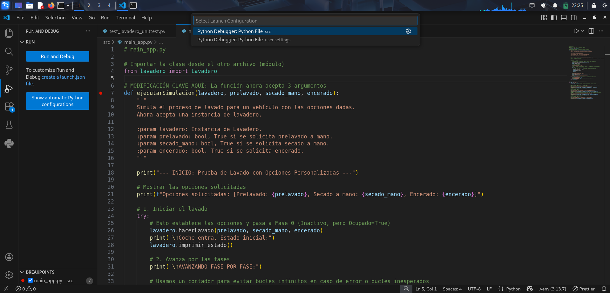

# Ejecución y Depuración

En este apartado se documentan los problemas detectados durante la ejecución y pruebas de la aplicación `Lavadero`, así como las soluciones aplicadas.



---

## 1. Error en la llamada a la simulación del lavado

**Problema detectado:**

Al no indicar en el ejemplo 4 el parámetro `encerado`, Python lo tomaba por defecto como `True`, lo que provocaba errores posteriores en la lógica de negocio.

**Solución aplicada:**

Se añadió explícitamente el parámetro `encerado=False` para que la simulación refleje correctamente las opciones deseadas:

```python
ejecutarSimulacion(lavadero_global, prelavado=True, secado_mano=False, encerado=False)
```
---
## 2. Regla de negocio del encerado

**Problema detectado:**

En `Lavadero.hacerLavado` existía esta validación:

```python
if not secado_a_mano and encerado:
    raise ValueError("No se puede encerar el coche sin secado a mano")
```

Si se solicitaba encerado sin secado a mano, el programa lanzaba un error y detenía la ejecución.

**Solución aplicada:**

Se modificó para activar automáticamente el secado a mano cuando se solicita encerado:

```python
if encerado and not secado_a_mano:
    secado_a_mano = True
    print("AVISO: Se ha activado secado a mano automáticamente porque se solicitó encerado.")
```
---
## 3. Capturas de depuración sin fallo


