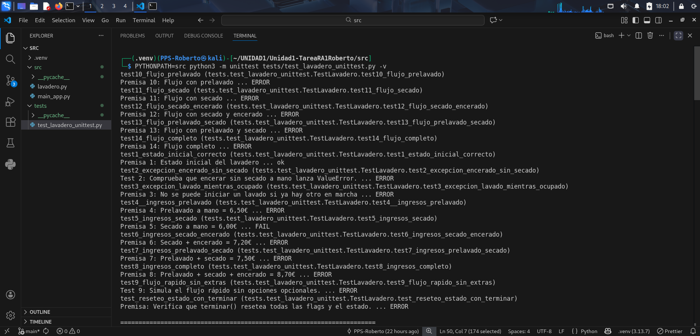

# Prueba de aplicaciones en un entorno de ejecución controlado (Sandboxing)

En este apartado se describe cómo se creó un **entorno de ejecución aislado** para probar la aplicación `lavadero.py` utilizando **Firejail** y su interfaz gráfica **Firetools**.

---

## 1. Preparación del entorno sandbox

Para garantizar la seguridad y el aislamiento del sistema, se siguieron los siguientes pasos:

### 1.1 Instalación de Firejail y Firetools

```bash
sudo apt update
sudo apt install firejail -y
sudo apt install firetools -y
```

### 1.2 Crear un entorno virtual de Python

```bash
python3 -m venv .venv       # Crear entorno virtual
source .venv/bin/activate   # Activar entorno virtual

# Instalación de dependencias para lavadero.py
pip install -r requeriments.txt
pip install -e .
```

### 1.3 Ejecutar la aplicación en sandbox

Para aislar la ejecución de la aplicación:

```bash
firejail --private=.venv python3 src/lavadero.py
```


### 1.4 Ejecución de pruebas unitarias

```bash
PYTHONPATH=src python3 -m unittest tests/test_lavadero_unittest.py -v
```



> Al ser la primera prueba, me salen todos los fallos de la aplicación
